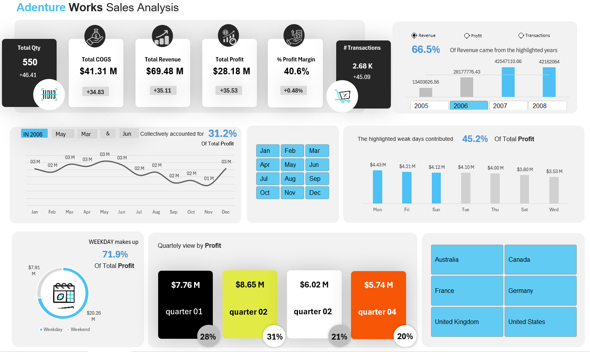

# 📊 Adventure Works Sales Analysis Dashboard

## Dashboard Preview

---

## 📌 Project Overview

This project presents a **Sales Analysis Dashboard** built using Excel, Power Query, Power Pivot, and DAX.
The dashboard analyzes revenue, profit, transactions, and sales performance across different time periods and regions to provide clear business insights.

---

## 

**Power Query**
Cleaning, transforming, and preparing raw sales data.

**Power Pivot Relationships**
Building relationships between tables to create a dynamic data model.

**DAX Calculations**
Creating measures for Revenue, Profit, and KPIs.

**Excel Functions**
Using Excel formulas to enhance data analysis.

**Visual Storytelling**
Designing interactive visuals to present insights clearly.

---

## Key Insights

* Total Revenue, Profit, and COGS KPIs
* Profit Margin Analysis
* Monthly Sales Trend
* Profit Contribution by Weekday
* Quarterly Profit Comparison
* Sales Analysis by Country

---

## Tools Used

* Microsoft Excel
* Power Query
* Power Pivot
* DAX
